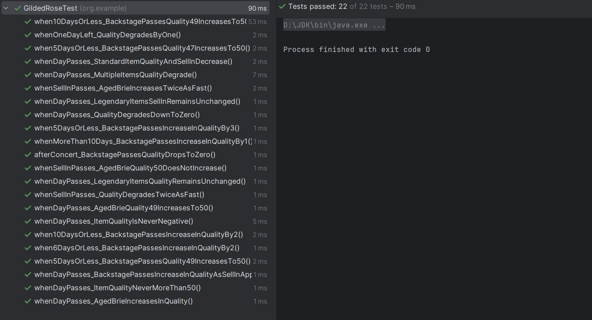

# Overview of the Gilded Rose Inventory Management Program

This Gilded Rose Inventory Management Program is a Java application designed to manage and update the inventory for a fantasy inn called the Gilded Rose (the Gilded Rose is imagined as an inn in a fantasy world where adventurers would buy and sell items, hence the inventory management system). It encapsulates the core functionalities required to track items in the inventory and update their quality and sell-in values based on various rules.

## Key Features
- **Item Management**: The program handles different categories of items, including standard items, aged items, legendary items and backstage passes.
- **Quality Tracking**: It tracks the quality of each item and updates it daily according to specific rules.
- **Sell-In Tracking**: The program manages the sell-in value for each item, which represents the number of days left to sell the item.
- **Special Rules Handling**: Special rules are applied to certain items like “Aged Brie” and “Sulfuras, Hand of Ragnaros”, which behave differently from standard items.

## Design
The application is designed with the following classes:
- `Item`: Represents an item in the inventory with a name, sell-in period and quality value.
- `GildedRose`: Manages an array of items and updates their quality and sell-in values each day.
- `Main`: The entry point of the program, setting up sample items and simulating the update process over a number of days.

## Key remarks
- **Project Naming**: Renamed `gilded-rose-master` name of project to `gilded-rose-adding-tests` – project names should use lowercase letters and hyphens, be unique and original.
- **Metadata in Classes**: Added metadata in each class (`Item`, `GildedRose`, `Main` and `GildedRoseTest`) to provide clarity on the authorship, project, class purpose, version and date of creation.
- **Code Comments in Class `GildedRoseTest`**: Added appropriate comments for clarity and emphasizing the expected results for each test in the class.
- **Indentation and Formatting in Class `GildedRoseTest`**: Adjusted indentation and blank lines throughout the code with tests for consistency and adherence to style guide guidelines (Google Java Style Guide).
- **Readability in Class `GildedRoseTest`**: Formatted code with tests consistently to improve readability and maintainability.

## Testing

### Overview
The `GildedRoseTest` class contains a comprehensive suite of unit tests that verify the functionality of the `GildedRose` class, particularly the `updateQuality` method. These tests ensure that the method correctly updates the sell-in and quality values of items in the inventory according to the specified rules.

### Test Cases
The tests cover a wide range of scenarios, including:
- Standard items with a normal rate of quality degradation.
- Items that degrade in quality twice as fast after the sell-in date has passed.
- “Aged Brie” items that increase in quality over time.
- Legendary items like “Sulfuras” that do not degrade in quality or require a sell-in.
- “Backstage passes” that increase in quality as the concert date approaches, with varying rates of increase.

### Test Methods
The following is a list of test method names, each describing the specific scenario it tests:

- `whenDayPasses_StandardItemQualityAndSellInDecrease`
- `whenDayPasses_MultipleItemsQualityDegrade`
- `whenSellInPasses_QualityDegradesTwiceAsFast`
- `whenOneDayLeft_QualityDegradesByOne`
- `whenDayPasses_QualityDegradesDownToZero`
- `whenDayPasses_ItemQualityIsNeverNegative`
- `whenDayPasses_AgedBrieIncreasesInQuality`
- `whenDayPasses_AgedBrieQuality49IncreasesTo50`
- `whenDayPasses_ItemQualityNeverMoreThan50`
- `whenSellInPasses_AgedBrieIncreasesTwiceAsFast`
- `whenSellInPasses_AgedBrieQuality50DoesNotIncrease`
- `whenDayPasses_LegendaryItemsSellInRemainsUnchanged`
- `whenDayPasses_LegendaryItemsQualityRemainsUnchanged`
- `whenDayPasses_BackstagePassesIncreaseInQualityAsSellInApproaches`
- `whenMoreThan10Days_BackstagePassesIncreaseInQualityBy1`
- `when10DaysOrLess_BackstagePassesIncreaseInQualityBy2`
- `when10DaysOrLess_BackstagePassesQuality49IncreasesTo50`
- `when6DaysOrLess_BackstagePassesIncreaseInQualityBy2`
- `when5DaysOrLess_BackstagePassesIncreaseInQualityBy3`
- `when5DaysOrLess_BackstagePassesQuality47IncreasesTo50`
- `when5DaysOrLess_BackstagePassesQuality49IncreasesTo50`
- `afterConcert_BackstagePassesQualityDropsToZero`

Each test method name is self-explanatory, reflecting the specific rule or behavior it verifies within the Gilded Rose inventory system.

### Running Tests
To run the tests, ensure that JUnit is set up in the project. If using Maven, the dependencies should be defined in the `pom.xml`.

### Results of Tests
The results of tests is presented on image below (all tests were successful):

