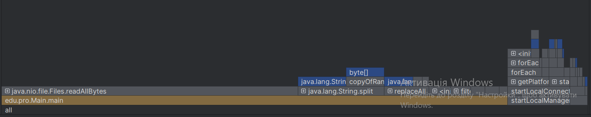
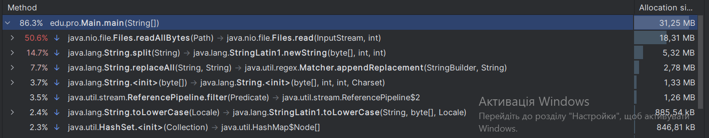
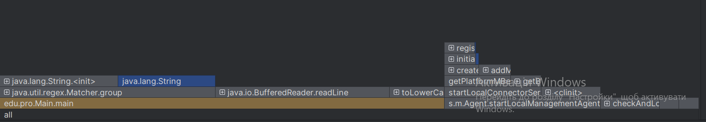
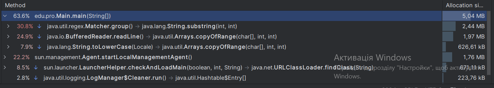
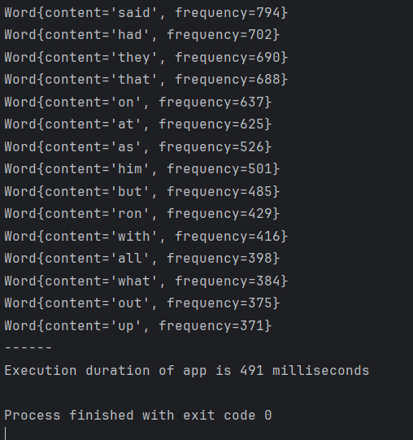

# Optimizing Java Code by Memory

This project is about optimizing a previously refactored Java program responsible for analyzing word frequencies in a text file ('harry.txt'). The optimization is focused on efficient memory resource management, leveraging knowledge and mastery of technologies to improve performance.

## Memory Optimizations

The following changes were made to optimize memory usage in the `harry-potter-word-counter` project (renamed to `harry-potter-word-counter-memoryOptimized`:

### BufferedReader for Line-by-Line Reading

* Replaced reading the entire file content into a single `String` with a `BufferedReader` to read the file line by line. This reduces the memory footprint significantly, especially for large files.

### Regular Expression with Matcher

* Utilized a `Pattern` and `Matcher` to find words within each line, avoiding the creation of large arrays from splitting the entire content at once. Note that while this method is more memory-efficient than previous versions, it can still require a substantial amount of memory for very large text files.

### HashMap for Frequency Count

* Employed a `HashMap` to keep track of word frequencies instead of using a `Set` and multiple streams, which minimizes the number of iterations over the data.

### Stream API for Sorting and Collecting

* Streamlined the process of converting the map entries to `Word` objects, sorting them, and collecting the results into a list using the Stream API.

### Constant File Path

* Defined the file path as a constant (`FILE_PATH`) to avoid hardcoding it in multiple places, making the code cleaner and easier to maintain.

## Version Update

The project version was updated to 1.0.1 to reflect these optimizations.

## Code Quality and Standards

The codebase has been meticulously crafted to adhere to the Google Java Style Guide, ensuring a high standard of code quality and consistency. Key highlights include:

### Adherence to Style Guide

The code follows all necessary requirements of the Google Java Style Guide, including naming conventions, structure, and formatting.

### Metadata

* Metadata annotations have been updated to reflect the current state of the project, including authorship, versioning, and date of modifications.

### Enhanced Readability

* Indentation and spacing have been adjusted to improve readability, making the code easier to understand and maintain.

### Comprehensive Comments

* Comments have been added throughout the code to explain the functionality and logic, providing clarity on complex sections.

## Previously Refactored Code

The previously refactored code is given below:

### Class `Word`:

```java
package edu.pro;

/**
 * Class for counting word frequency in text files.
 *
 * @author Volodymyr Voroniuk
 * @project harry-potter-word-counter
 * @class Word
 * @version 1.0.0
 * @since 25.02.24 - 11.10
 */
public class Word {
    // Use a blank line after the class declaration
    private String wordContent; // The content of the word
    private int frequency;    // The frequency of the word

    // Use @param tag for documenting parameters
    /**
     * Constructs a Word object with the given content and frequency.
     *
     * @param wordContent the content of the word
     * @param frequency the frequency of the word
     */
    public Word(String wordContent, int frequency) {
        this.wordContent = wordContent;
        this.frequency = frequency;
    }

    // Default constructor for the Word class
    public Word() {
    }

    // Use @return tag for documenting return values
    /**
     * Gets the content of the word.
     *
     * @return the content of the word
     */
    public String getWordContent() {
        return wordContent;
    }

    /**
     * Gets the frequency of the word.
     *
     * @return the frequency of the word
     */
    public int getFrequency() {
        return frequency;
    }

    /**
     * Sets the content of the word.
     *
     * @param wordContent the new content of the word
     */
    public void setWordContent(String wordContent) {
        this.wordContent = wordContent;
    }

    /**
     * Sets the frequency of the word.
     *
     * @param frequency the new frequency of the word
     */
    public void setFrequency(int frequency) {
        this.frequency = frequency;
    }

    /**
     * Provides a string representation of the Word object.
     *
     * @return a string representation of the Word object
     */
    @Override
    public String toString() {
        return "Word{" +
                "content='" + wordContent + '\'' +
                ", frequency=" + frequency +
                '}';
    }
}
```

### Class `Main`:

```java
package edu.pro;

import java.io.IOException;
import java.nio.file.Files;
import java.nio.file.Paths;
import java.time.LocalDateTime;
import java.time.temporal.ChronoUnit;
import java.util.*;

/**
 * Main class for processing a text file and displaying word frequencies.
 *
 * @author Volodymyr Voroniuk
 * @project harry-potter-word-counter
 * @class Main
 * @version 1.0.0
 * @since 25.02.24 - 11.10
 */
public class Main {

    public static void main(String[] args) throws IOException {

        // Record the start time for performance measurement
        LocalDateTime start = LocalDateTime.now();

        // Read the content of the file into a String
        String content = new String(Files.readAllBytes(Paths.get("src/edu/pro/txt/harry.txt")));
        // Clean up the content by removing non-alphabetic characters and converting to lower case
        String contentCleaned = content.replaceAll("[^A-Za-z ]", " ").toLowerCase(Locale.ROOT);

        // Split the content into words
        String[] words = contentCleaned.split(" +");

        // Create a set to store distinct words
        Set<String> distinctWords = new HashSet<>(Arrays.asList(words));

        // Create a list to store words with their frequencies
        List<Word> wordsList = new ArrayList<>();

        // Count the frequency of each distinct word and add it to the list
        for (String distinct : distinctWords) {
            int count = (int) Arrays.stream(words)
                    .filter(distinct::equals)
                    .count();
            wordsList.add(new Word(distinct, count));
        }

        // Sort the list by frequency in descending order
        wordsList.sort(Comparator.comparingInt(Word::getFrequency).reversed());

        // Print the top 30 most frequent words
        System.out.println("Words and their frequency:\n");
        wordsList.stream().limit(30).forEach(System.out::println);

        // Record the finish time for performance measurement
        LocalDateTime finish = LocalDateTime.now();

        // Print the time taken to process
        System.out.println("------");
        System.out.println("Execution duration of app is " + ChronoUnit.MILLIS.between(start, finish) + " milliseconds");
    }
}
```

## Memory Optimized Code

The memory optimized code is given below (modification made only in class `Main`):

```java
package edu.pro;

import java.io.BufferedReader;
import java.io.FileReader;
import java.io.IOException;
import java.time.LocalDateTime;
import java.time.temporal.ChronoUnit;
import java.util.*;
import java.util.regex.Matcher;
import java.util.regex.Pattern;
import java.util.stream.Collectors;

/**
 * Main class for processing a text file and displaying word frequencies.
 *
 * @author Volodymyr Voroniuk
 * @project harry-potter-word-counter
 * @class Main
 * @version 1.0.1
 * @since 01.03.24 - 11.10
 */
public class Main {

    // Constant for the file path to make it easy to change the file location if necessary
    public static final String FILE_PATH = "src/edu/pro/txt/harry.txt";

    public static void main(String[] args) throws IOException {

        // Record the start time for performance measurement
        LocalDateTime start = LocalDateTime.now();

        // Define the pattern to match words using a regular expression
        Pattern wordPattern = Pattern.compile("[A-Za-z]+");

        // Open a BufferedReader to read the file line by line for efficiency
        try (BufferedReader reader = new BufferedReader(new FileReader(FILE_PATH))) {
            // Create a map to store word frequencies
            Map<String, Integer> wordFrequencies = new HashMap<>();

            // Read each line from the file
            String currentLine;
            while ((currentLine = reader.readLine()) != null) {
                // Use Matcher to find words in the currentLine
                Matcher matcher = wordPattern.matcher(currentLine.toLowerCase(Locale.ROOT));

                // Find each word and count its frequency
                while (matcher.find()) {
                    String word = matcher.group();
                    // Update the frequency count for each word in the map
                    wordFrequencies.put(word, wordFrequencies.getOrDefault(word, 0) + 1);
                }
            }

            // Convert the map entries to Word objects and sort by frequency
            List<Word> wordsList = wordFrequencies.entrySet().stream()
                    .map(entry -> new Word(entry.getKey(), entry.getValue()))
                    .sorted(Comparator.comparingInt(Word::getFrequency).reversed())
                    .collect(Collectors.toList());

            // Print the top 30 most frequent words
            System.out.println("Words and their frequency:\n");
            // Limiting the printed list to the top 30 words
            wordsList.stream().limit(30).forEach(System.out::println);
        }

        // Record the finish time for performance measurement
        LocalDateTime finish = LocalDateTime.now();

        // Print the time taken to process
        System.out.println("------");
        // Calculating the duration of the execution in milliseconds
        System.out.println("Execution duration of app is " + ChronoUnit.MILLIS.between(start, finish) + " milliseconds");
    }
}
```

## Previously Refactored Code (Memory Allocations)

The memory allocations of previously refactored code is presented on images below:





## Memory Optimized Code

The memory allocations of memory optimized code is presented on images below:





## Result Sample

The result sample is presented on image below:

