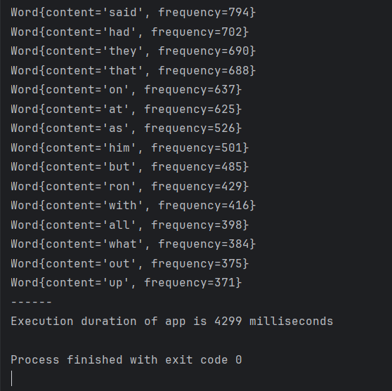
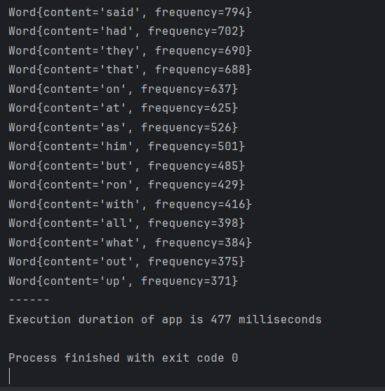
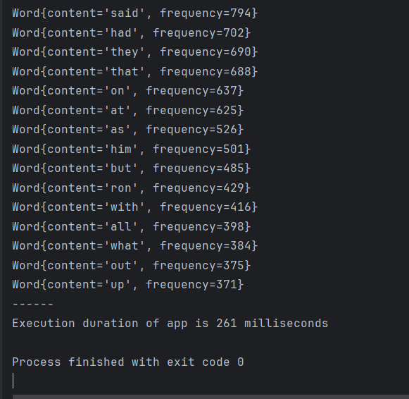
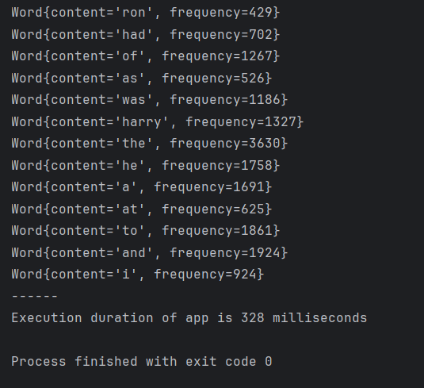

# Optimizing Java Code for Operating Speed (Performance)

This project is about optimizing a previously refactored Java program responsible for analyzing word frequencies in a text file ('harry.txt'). The optimization is dedicated to enhancing the speed and performance of a Java program. The optimization efforts are centered around improving the execution speed of the program, ensuring that the analysis of the text is not only accurate but also time-efficient. By employing various optimization techniques and fine-tuning the code, the aim is to minimize the processing time, making the program more responsive and efficient in handling not only small, but also large datasets.

## Operating Speed Optimizations (Used Previously Memory Optimized Code)

The changes that were made to optimize memory usage in the `harry-potter-word-counter` project also enhanced the level of operating speed in this project:

### Efficient File Reading with BufferedReader

* Implemented a `BufferedReader` to read the file line by line, which is generally faster than reading the entire file into memory at once. This approach can significantly improve performance, especially for large files.

### Streamlined Word Matching with Regular Expressions

* Utilized a compiled `Pattern` and `Matcher` to efficiently find words within each line. This method is typically faster than splitting strings, as it avoids creating intermediate arrays and leverages the optimized regex engine.

### HashMap for On-the-Fly Frequency Count

* A `HashMap` was used to track word frequencies dynamically as the file is read. This approach avoids the overhead of creating a separate set of distinct words and reduces the complexity of counting operations.

### Stream API for Sorting and Collecting

* Leveraged the Stream API to convert the map entries to `Word` objects, sort them by frequency, and collect the results. This method benefits from the Stream API’s optimized operations and potential for parallel execution.

### Constant File Path

* Maintained the use of a constant (`FILE_PATH`) for the file path, ensuring that the code remains clean and maintainable.

### Performance Measurement

Kept precise performance measurement using `LocalDateTime` to calculate the duration of the execution in milliseconds, providing clear metrics for assessing speed improvements.

## Previously Refactored Code

The previously refactored code is given below:

### Class `Word`:

```java
package edu.pro;

/**
 * Class for counting word frequency in text files.
 *
 * @author Volodymyr Voroniuk
 * @project harry-potter-word-counter
 * @class Word
 * @version 1.0.0
 * @since 25.02.24 - 11.10
 */
public class Word {
    // Use a blank line after the class declaration
    private String wordContent; // The content of the word
    private int frequency;    // The frequency of the word

    // Use @param tag for documenting parameters
    /**
     * Constructs a Word object with the given content and frequency.
     *
     * @param wordContent the content of the word
     * @param frequency the frequency of the word
     */
    public Word(String wordContent, int frequency) {
        this.wordContent = wordContent;
        this.frequency = frequency;
    }

    // Default constructor for the Word class
    public Word() {
    }

    // Use @return tag for documenting return values
    /**
     * Gets the content of the word.
     *
     * @return the content of the word
     */
    public String getWordContent() {
        return wordContent;
    }

    /**
     * Gets the frequency of the word.
     *
     * @return the frequency of the word
     */
    public int getFrequency() {
        return frequency;
    }

    /**
     * Sets the content of the word.
     *
     * @param wordContent the new content of the word
     */
    public void setWordContent(String wordContent) {
        this.wordContent = wordContent;
    }

    /**
     * Sets the frequency of the word.
     *
     * @param frequency the new frequency of the word
     */
    public void setFrequency(int frequency) {
        this.frequency = frequency;
    }

    /**
     * Provides a string representation of the Word object.
     *
     * @return a string representation of the Word object
     */
    @Override
    public String toString() {
        return "Word{" +
                "content='" + wordContent + '\'' +
                ", frequency=" + frequency +
                '}';
    }
}
```

### Class `Main`:

```java
package edu.pro;

import java.io.IOException;
import java.nio.file.Files;
import java.nio.file.Paths;
import java.time.LocalDateTime;
import java.time.temporal.ChronoUnit;
import java.util.*;

/**
 * Main class for processing a text file and displaying word frequencies.
 *
 * @author Volodymyr Voroniuk
 * @project harry-potter-word-counter
 * @class Main
 * @version 1.0.0
 * @since 25.02.24 - 11.10
 */
public class Main {

    public static void main(String[] args) throws IOException {

        // Record the start time for performance measurement
        LocalDateTime start = LocalDateTime.now();

        // Read the content of the file into a String
        String content = new String(Files.readAllBytes(Paths.get("src/edu/pro/txt/harry.txt")));
        // Clean up the content by removing non-alphabetic characters and converting to lower case
        String contentCleaned = content.replaceAll("[^A-Za-z ]", " ").toLowerCase(Locale.ROOT);

        // Split the content into words
        String[] words = contentCleaned.split(" +");

        // Create a set to store distinct words
        Set<String> distinctWords = new HashSet<>(Arrays.asList(words));

        // Create a list to store words with their frequencies
        List<Word> wordsList = new ArrayList<>();

        // Count the frequency of each distinct word and add it to the list
        for (String distinct : distinctWords) {
            int count = (int) Arrays.stream(words)
                    .filter(distinct::equals)
                    .count();
            wordsList.add(new Word(distinct, count));
        }

        // Sort the list by frequency in descending order
        wordsList.sort(Comparator.comparingInt(Word::getFrequency).reversed());

        // Print the top 30 most frequent words
        System.out.println("Words and their frequency:\n");
        wordsList.stream().limit(30).forEach(System.out::println);

        // Record the finish time for performance measurement
        LocalDateTime finish = LocalDateTime.now();

        // Print the time taken to process
        System.out.println("------");
        System.out.println("Execution duration of app is " + ChronoUnit.MILLIS.between(start, finish) + " milliseconds");
    }
}
```

## Previously Memory Optimized Code (Also Includes Operating Speed Optimizations)

The previously memory optimized code is given below (modification made only in class `Main`):

```java
package edu.pro;

import java.io.BufferedReader;
import java.io.FileReader;
import java.io.IOException;
import java.time.LocalDateTime;
import java.time.temporal.ChronoUnit;
import java.util.*;
import java.util.regex.Matcher;
import java.util.regex.Pattern;
import java.util.stream.Collectors;

/**
 * Main class for processing a text file and displaying word frequencies.
 *
 * @author Volodymyr Voroniuk
 * @project harry-potter-word-counter
 * @class Main
 * @version 1.0.1
 * @since 01.03.24 - 11.10
 */
public class Main {

    // Constant for the file path to make it easy to change the file location if necessary
    public static final String FILE_PATH = "src/edu/pro/txt/harry.txt";

    public static void main(String[] args) throws IOException {

        // Record the start time for performance measurement
        LocalDateTime start = LocalDateTime.now();

        // Define the pattern to match words using a regular expression
        Pattern wordPattern = Pattern.compile("[A-Za-z]+");

        // Open a BufferedReader to read the file line by line for efficiency
        try (BufferedReader reader = new BufferedReader(new FileReader(FILE_PATH))) {
            // Create a map to store word frequencies
            Map<String, Integer> wordFrequencies = new HashMap<>();

            // Read each line from the file
            String currentLine;
            while ((currentLine = reader.readLine()) != null) {
                // Use Matcher to find words in the currentLine
                Matcher matcher = wordPattern.matcher(currentLine.toLowerCase(Locale.ROOT));

                // Find each word and count its frequency
                while (matcher.find()) {
                    String word = matcher.group();
                    // Update the frequency count for each word in the map
                    wordFrequencies.put(word, wordFrequencies.getOrDefault(word, 0) + 1);
                }
            }

            // Convert the map entries to Word objects and sort by frequency
            List<Word> wordsList = wordFrequencies.entrySet().stream()
                    .map(entry -> new Word(entry.getKey(), entry.getValue()))
                    .sorted(Comparator.comparingInt(Word::getFrequency).reversed())
                    .collect(Collectors.toList());

            // Print the top 30 most frequent words
            System.out.println("Words and their frequency:\n");
            // Limiting the printed list to the top 30 words
            wordsList.stream().limit(30).forEach(System.out::println);
        }

        // Record the finish time for performance measurement
        LocalDateTime finish = LocalDateTime.now();

        // Print the time taken to process
        System.out.println("------");
        // Calculating the duration of the execution in milliseconds
        System.out.println("Execution duration of app is " + ChronoUnit.MILLIS.between(start, finish) + " milliseconds");
    }
}
```

## Previously Refactored Code and Previously Memory Optimized Code (Operating Speed Comparison)

The level of operating speed of previously refactored code is presented on image below:



The level of operating speed of previously memory optimized code is presented on image below:



As we can see, the value of execution duration of app for previously refactored code is `4299 milliseconds`, while for previously memory optimized code is `477 milliseconds`. That means that operating speed was improved significantly (almost in ten times).

## Operating Speed Optimizations (Further Operating Speed Optimizations of Memory Optimized Code)

The following changes were made to optimize operating speed in the `harry-potter-word-counter-memoryOptimized` project (renamed to `harry-potter-word-counter-performanceOptimized`):

### Efficient Word Frequency Counting with HashMap Merge

* Replaced the `put` method with `merge` for updating the word frequency count in the `HashMap`. The `merge` method is more concise and can be slightly faster as it combines the check and update operations into a single method call.

### Streamlined Word Matching with Regular Expressions

* Continued the use of a compiled `Pattern` and `Matcher` to efficiently find words within each line. This method is typically faster than splitting strings, as it avoids creating intermediate arrays and leverages the optimized regex engine.

### Direct Stream Sorting and Limiting

* Optimized the stream operations by directly sorting the `Map` entries and limiting the output to the top 30 words within the same stream pipeline. This reduces the overhead of handling intermediate collections and stream operations.

### Performance Measurement Enhancements

* Again maintained precise performance measurement using `LocalDateTime` to calculate the duration of the execution in milliseconds, providing clear metrics for assessing speed improvements.

## Version Update

The project version was updated to 1.0.2 to reflect these optimizations.

## Code Quality and Standards

The codebase has been meticulously crafted to adhere to the Google Java Style Guide, ensuring a high standard of code quality and consistency. Key highlights include:

### Adherence to Style Guide

The code follows all necessary requirements of the Google Java Style Guide, including naming conventions, structure, and formatting.

### Metadata

* Metadata annotations have been updated to reflect the current state of the project, including authorship, versioning, and date of modifications.

### Enhanced Readability

* Indentation and spacing have been adjusted to improve readability, making the code easier to understand and maintain.

### Comprehensive Comments

* Comments have been added throughout the code to explain the functionality and logic, providing clarity on complex sections.

## Operating Speed  Optimized Code (Final Result)

The operating speed optimized code is given below (modification made only in class `Main`):

```java
package edu.pro;

import java.io.BufferedReader;
import java.io.FileReader;
import java.io.IOException;
import java.time.LocalDateTime;
import java.time.temporal.ChronoUnit;
import java.util.*;
import java.util.regex.Matcher;
import java.util.regex.Pattern;

/**
 * Main class for processing a text file and displaying word frequencies.
 *
 * @author Volodymyr Voroniuk
 * @project harry-potter-word-counter
 * @class Main
 * @version 1.0.2
 * @since 11.03.24 - 11.10
 */
public class Main {

    // Constant for the file path to make it easy to change the file location if necessary
    public static final String FILE_PATH = "src/edu/pro/txt/harry.txt";

    public static void main(String[] args) throws IOException {

        // Record the start time for performance measurement
        LocalDateTime start = LocalDateTime.now();

        // Define the pattern to match words using a regular expression
        Pattern wordPattern = Pattern.compile("[A-Za-z]+");

        // Create a map to store word frequencies
        Map<String, Integer> wordFrequencies = new HashMap<>();

        // Open a BufferedReader to read the file line by line for efficiency
        try (BufferedReader reader = new BufferedReader(new FileReader(FILE_PATH))) {
            // Read each line from the file
            String currentLine;
            while ((currentLine = reader.readLine()) != null) {
                // Use Matcher to find words in the currentLine
                Matcher matcher = wordPattern.matcher(currentLine.toLowerCase());

                // Find each word and count its frequency
                while (matcher.find()) {
                    String word = matcher.group();
                    // Update the frequency count for each word in the map
                    wordFrequencies.merge(word, 1, Integer::sum);
                }
            }
        }

        // Print the top 30 most frequent words
        System.out.println("Words and their frequency:\n");
        // Convert the map entries to Word objects and sort by frequency
        wordFrequencies.entrySet().stream()
                .map(entry -> new Word(entry.getKey(), entry.getValue()))
                .sorted(Comparator.comparingInt(Word::getFrequency).reversed())
                .limit(30) // Limit the sorted stream to the top 30 words
                .forEach(System.out::println);

        // Record the finish time for performance measurement
        LocalDateTime finish = LocalDateTime.now();

        // Print the time taken to process
        System.out.println("------");
        // Calculating the duration of the execution in milliseconds
        System.out.println("Execution duration of app is " + ChronoUnit.MILLIS.between(start, finish) + " milliseconds");
    }
}
```

## Previously Memory Optimized Code and Operating Speed Optimized Code (Speed Operating Comparison)

The level of operating speed of previously memory optimized code was presented on image earlier. The new level of operating speed of optimized code is presented on image below:



As we can see, the value of execution duration of app for operating speed optimized code is `261 milliseconds`, while for previously memory optimized code is `477 milliseconds`. That means that operating speed was improved a bit more (almost in two times).

## Important Remarks

* All above stated optimizations are aimed at reducing the execution time of the application, making it more efficient in processing and analyzing the text file. The actual performance gains may vary based on the size of the dataset and the hardware capabilities. It’s recommended to profile the application with different datasets to measure the impact of these optimizations accurately.
* If we have a multicore processor, we can take advantage of parallel streams to speed up the sorting and collecting process. However, parallel streams can sometimes lead to unpredictable performance improvements, especially for smaller datasets or on systems with fewer cores. It’s also important to profile application before and after making changes to ensure that the optimizations are having the desired effect. Additionally, we should be cautious with parallel streams as they can introduce thread-safety issues if not used correctly. The example is presented below:

```java
// Convert the map entries to Word objects and sort by frequency
wordFrequencies.entrySet().parallelStream()
        .map(entry -> new Word(entry.getKey(), entry.getValue()))   
        .sorted(Comparator.comparingInt(Word::getFrequency).reversed())
        .limit(30) // Limit the sorted stream to the top 30 words
        .forEach(System.out::println);
// ... (remaining logic)
```

This change utilizes the `parallelStream` method instead of `stream` to take advantage of parallel processing, potentially improving the performance of the word frequency counting process. The result is presented on image below:



As we can see, the usage of the `parallelStream` method doesn't give us advantage. The value of execution duration of app now is `328 milliseconds`, while with usage of the `stream` method it was `271 milliseconds`. The reason is that the size of file is small and for bigger datasets parallel streams can be more beneficial.