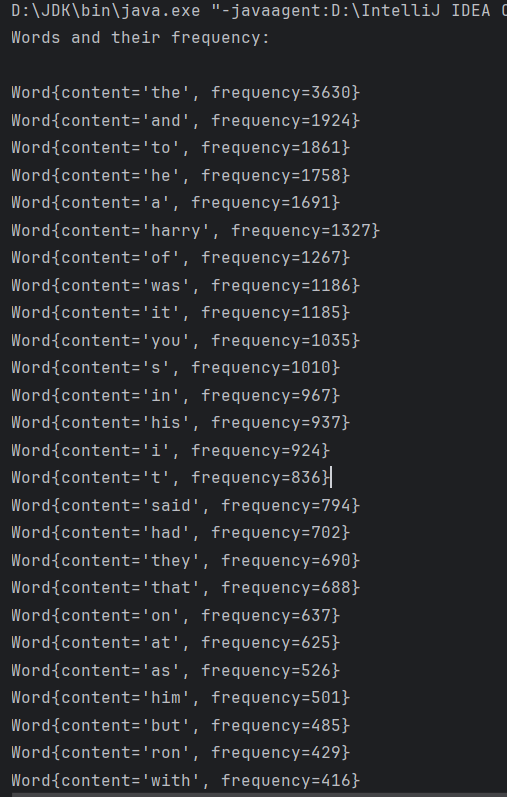

# Refactoring Java Code

This project is about refactoring a Java program responsible for analyzing word frequencies in a text file ('harry.txt'). The original code suffered from readability issues, lack of adherence to coding standards, inefficient word frequency calculations and does not follow any coding standards or conventions. The refactored code is based on the Google Java Style Guide, which can be found here: https://google.github.io/styleguide/javaguide.html

## Remarks

### 1. Project Naming:

* Renamed `harrry-potter` name of project to `harry-potter-word-counter` – project names should use lowercase letters and hyphens, be unique and original.

### 2. Addition of Class `Word`:

* Introduced the `Word` class to encapsulate word information, enhancing data organization and encapsulation.

### 3. Package Declaration in Class `Word`:

* Added the package declaration `package edu.pro;` to organize the code within the `edu.pro` package. This improves code modularity and namespace management.

### 4. Metadata in Class `Word`:

* Added metadata information at the start of file, which can be beneficial for documentation and version control: `@author`: specifies the author of the code, `@project`: represents the name of the project, `@class`: indicates the class name, `@version`: indicates the version number of the code, `@since`: describes when the code was first introduced or modified.

### 5. Code Comments in Class `Word`:

* Added appropriate comments for code.

### 6. Class Fields in Class `Word`:

* Included the fields `wordContent` and `frequency` with `private` modifier for encapsulating them within the class and for encapsulating word information.

### 7. Documenting in Class `Word`:

* Added `@param` and `@return` tags throughout the code for documenting parameters and return values respectively.

### 8. Constructors in Class `Word`:

* Added a default constructor, that allows the creation of a `Word` object without specifying initial values for the `wordContent` and `frequency` fields. This constructor is useful when instances of the `Word` class need to be created with default values or when initializing the object's fields is deferred to a later stage.

### 9. Getter and Setter Methods in Class `Word`:

* Added getter and setter methods for `wordContent` and `frequency` fields (`getFrequency` is used in `Main` class).

### 10. `toString()` Method in Class `Word`:

* The `Word` class overrides the `toString()` method to provide a string representation of the object. This `toString()` implementation is helpful for debugging and providing a human-readable representation of a `Word` instance.

### 11. Import Statements in Class `Main`:

* Removed unnecessary import statements
* Added a wildcard (`*`) in the import statement for the `java.util` package. This allows importing all classes from the `java.util` package, making the code more concise.
* Note: while a wildcard reduces the need for listing individual classes, it's important to be cautious about potential naming conflicts. If multiple packages have classes with the same name, using wildcards may lead to ambiguity and naming issues.

### 12. Metadata in Class `Main`:

* Added metadata information at the start of file, which can be beneficial for documentation and version control

### 13. Code Comments in Class `Main`:

* Added appropriate comments for code.

### 14. Removal of `cleanText` Method in Class `Main`:

* Removed the `cleanText` method, which read text from a file, removed non-alphabetic characters and converted it to lowercase. It was eliminated for reasons such as simplifying the code, improving readability and restructuring the logic.

### 15. Addition of New Variable in Class `Main`:
    
* Instead of reassigning the cleaned content to the existing `content` variable, a new variable `contentCleaned` was introduced to store the cleaned text. This change have been made for reasons such as improving code readability and avoiding potential side effects.
* Used the cleaned content stored in the `contentCleaned` variable for word tokenization instead of the original `content`. This modification was made to maintain consistency with the cleaned text and to reflect the updated variable used for further processing.

### 16. Words Processing in Class `Main`:

* The handling of words has been improved for clarity and efficiency. In the original code, the following logic was used:
```java
Arrays.sort(words);

String distinctString = " ";
for (int i = 0; i < words.length; i++) {
    if (!distinctString.contains(words[i])) {
        distinctString += words[i] + " ";
    }
}

String[] distincts = distinctString.split(" ");
int[] freq = new int[distincts.length];
// ... (rest of the logic)
```
Here's an explanation of each part:
1. `Arrays.sort(words);`: this line sorts the array of words alphabetically. It's not necessary for the subsequent frequency analysis, and its purpose may be to prepare the array for the subsequent logic.
2. `String distinctString = " ";`: initializes a string variable `distinctString` with a single space. This string is used to concatenate distinct words from the sorted array.
3. `for (int i = 0; i < words.length ; i++) { ... }`: this loop iterates through the sorted array of words. For each word, it checks whether the `distinctString` already contains the word. If not, it appends the word to `distinctString` with a space.
4. `String[] distincts = distinctString.split(" ");`: splits the `distinctString` into an array of distinct words. The split is based on spaces.
5. `int[] freq = new int[distincts.length];`: initializes an array `freq` to store the frequency of each distinct word.

This has been replaced with a more concise and efficient approach:
```java
// Split the content into words
String[] words = contentCleaned.split(" +");

// Create a set to store distinct words
Set<String> distinctWords = new HashSet<>(Arrays.asList(words));

// Create a list to store words with their frequencies
List<Word> wordsList = new ArrayList<>();
// ... (remaining logic)
```
* Used the `split` method directly on the cleaned content to create an array of words. Additionally, a `Set` with clear name `distinctWords` was employed to efficiently store distinct words, eliminating the need for sorting and manual checks for distinctness. This change simplifies the logic, making it more readable and potentially improving performance.
* `List<Word> wordsList = new ArrayList<>();`: initialized a new `ArrayList` named `wordsList` that contains objects of the `Word` class. This list is used to store instances of the `Word` class, where each instance represents a word and its frequency. It adds clarity to the code by highlighting the purpose of the data structure being used.

### 17. Word Frequency Counting in Class `Main`:

* The counting of word frequency has been improved for clarity and efficiency. In the original code, the following logic was used:

1. Counting word frequencies:

```java
int count = 0;
for (int j = 0; j < words.length; j++) {
    if (distincts[i].equals(words[j])) {
        count++;
    }
}
freq[i] = count;
```

This section counts the frequency of each distinct word. It initializes a counter (`count`) to zero and iterates through the `words` array, incrementing `count` whenever a match with the current distinct word is found. The final count is then stored in the `freq` array.

2. Appending frequencies to distinct words:

```java
for (int i = 0; i < distincts.length; i++) {
    distincts[i] += " " + freq[i];
}
```

This section concatenating the frequencies to the corresponding distinct words in the `distincts` array, separated by a space.

It's worth noting that this approach of modifying strings in the array is not the most efficient and clean. This has been replaced with a more concise and efficient approach:

```java
// Count the frequency of each distinct word and add it to the list
for (String distinct : distinctWords) {
    // Use stream API to count occurrences of the current distinct word in the 'words' array
    int count = (int) Arrays.stream(words)
            .filter(distinct::equals)
            .count();

    // Create a new Word object with the distinct word and its frequency, then add it to the list
    wordsList.add(new Word(distinct, count));
}
// ... (remaining logic)
```

* `int count = (int) Arrays.stream(words).filter(distinct::equals).count()`: utilized the Java Stream API to count the occurrences of the current distinct word in the `words` array. It filtered the array to include only elements equal to the current distinct word (`distinct::equals`) and then counted the occurrences. This allows more concise and readable way of counting word frequencies. Replacement of nested loops with a single stream operation improves code simplicity.
* `wordsList.sort(Comparator.comparingInt(Word::getFrequency).reversed())`: for each distinct word, a new `Word` object is created with the word and its calculated frequency. This `Word` object is then added to the `wordsList`. These changes improve the efficiency and readability of the code. Additionally, the use of a `List<Word>` provides a more structured representation of word-frequency pairs.

### 18. Words Sorting in Class `Main`:

* Replaced the sorting mechanism used in the original code (`Arrays.sort`) with a more modern and expressive approach using the sort method on a `List` of `Word` objects.
* `Comparator.comparingInt(Word::getFrequency).reversed()`: created a comparator that compares `Word` objects based on their frequencies in descending order. This change improves readability and leverages the capabilities for sorting.

### 19. Printing Result in Class `Main`:

* Added appropriate output message (`"Words and their frequency:\n"`) to be printed to serve as a header or introduction to the list of words and their frequencies that will be printed next for better clarity and readability.  
* Used the Stream API to output the top 30 words and their frequencies directly from the `wordsList`. This change leverages the concise and expressive nature of the Stream API, making the code more readable and maintaining the same functionality.

### 20, Printing App Execution Duration in Class `Main`:

* Modified output of app execution duration with addition of appropriate word hints for better clarity and readability.

### 21. Indentation

* Adjusted indentation and blank lines throughout the code for consistency and adherence to style guide guidelines.

### 22. Readability

* Added appropriate comments and output messages.
* Used meaningful variable and method names.
* Formatted code consistently.

## Original Code

The original code is given below:

```java
package edu.pro;

import java.io.IOException;
import java.nio.file.Files;
import java.nio.file.Paths;
import java.time.LocalDateTime;
import java.time.temporal.ChronoUnit;
import java.util.Arrays;
import java.util.Collections;
import java.util.Comparator;
import java.util.Locale;
import java.util.stream.Collectors;

public class Main {

    public static String cleanText(String url) throws IOException {
        String content = new String(Files.readAllBytes(Paths.get(url)));
        content = content.replaceAll("[^A-Za-z ]"," ").toLowerCase(Locale.ROOT);
        return content;
    }

    public static void main(String[] args) throws IOException {

        LocalDateTime start = LocalDateTime.now();
       // Path path = Paths.get()
        String content = new String(Files.readAllBytes(Paths.get("src/edu/pro/txt/harry.txt")));

        content = content.replaceAll("[^A-Za-z ]"," ").toLowerCase(Locale.ROOT);

        String[] words = content.split(" +"); // 400 000

        Arrays.sort(words);

        String distinctString = " ";

        for (int i = 0; i < words.length ; i++) {
            if (!distinctString.contains(words[i])){
                distinctString+= words[i] + " ";
            }
        }

        String[] distincts = distinctString.split(" ");
        int[] freq = new int[distincts.length];

        for (int i = 0; i < distincts.length ; i++) {
            int count = 0;
            for (int j = 0; j < words.length ; j++) {
                if (distincts[i].equals(words[j])) {
                    count++;
                }
            }
            freq[i] = count;
        }

        for (int i = 0; i < distincts.length ; i++) { // 5 000
            distincts[i] += " " + freq[i];
        }

        Arrays.sort(distincts, Comparator.comparing(str
                -> Integer.valueOf(str.replaceAll("[^0-9]", ""))));

        for (int i = 0; i < 30; i++) {
            System.out.println(distincts[distincts.length - 1 - i]);
        }
        LocalDateTime finish = LocalDateTime.now();

        System.out.println("------");
        System.out.println(ChronoUnit.MILLIS.between(start, finish));

    }
}
```

## Refactored Code

The refactored code is given below:

### Class `Word`:

```java
package edu.pro;

/**
 * Class for counting word frequency in text files.
 *
 * @author Volodymyr Voroniuk
 * @project harry-potter-word-counter
 * @class Word
 * @version 1.0.0
 * @since 25.02.24 - 11.10
 */
public class Word {
    // Use a blank line after the class declaration
    private String wordContent; // The content of the word
    private int frequency;    // The frequency of the word

    // Use @param tag for documenting parameters
    /**
     * Constructs a Word object with the given content and frequency.
     *
     * @param wordContent the content of the word
     * @param frequency the frequency of the word
     */
    public Word(String wordContent, int frequency) {
        this.wordContent = wordContent;
        this.frequency = frequency;
    }

    // Default constructor for the Word class
    public Word() {
    }

    // Use @return tag for documenting return values
    /**
     * Gets the content of the word.
     *
     * @return the content of the word
     */
    public String getWordContent() {
        return wordContent;
    }

    /**
     * Gets the frequency of the word.
     *
     * @return the frequency of the word
     */
    public int getFrequency() {
        return frequency;
    }

    /**
     * Sets the content of the word.
     *
     * @param wordContent the new content of the word
     */
    public void setWordContent(String wordContent) {
        this.wordContent = wordContent;
    }

    /**
     * Sets the frequency of the word.
     *
     * @param frequency the new frequency of the word
     */
    public void setFrequency(int frequency) {
        this.frequency = frequency;
    }

    /**
     * Provides a string representation of the Word object.
     *
     * @return a string representation of the Word object
     */
    @Override
    public String toString() {
        return "Word{" +
                "content='" + wordContent + '\'' +
                ", frequency=" + frequency +
                '}';
    }
}
```

### Class `Main`:

```java
package edu.pro;

import java.io.IOException;
import java.nio.file.Files;
import java.nio.file.Paths;
import java.time.LocalDateTime;
import java.time.temporal.ChronoUnit;
import java.util.*;

/**
 * Main class for processing a text file and displaying word frequencies.
 *
 * @author Volodymyr Voroniuk
 * @project harry-potter-word-counter
 * @class Main
 * @version 1.0.0
 * @since 25.02.24 - 11.10
 */
public class Main {

    public static void main(String[] args) throws IOException {

        // Record the start time for performance measurement
        LocalDateTime start = LocalDateTime.now();

        // Read the content of the file into a String
        String content = new String(Files.readAllBytes(Paths.get("src/edu/pro/txt/harry.txt")));
        // Clean up the content by removing non-alphabetic characters and converting to lower case
        String contentCleaned = content.replaceAll("[^A-Za-z ]", " ").toLowerCase(Locale.ROOT);

        // Split the content into words
        String[] words = contentCleaned.split(" +");

        // Create a set to store distinct words
        Set<String> distinctWords = new HashSet<>(Arrays.asList(words));

        // Create a list to store words with their frequencies
        List<Word> wordsList = new ArrayList<>();

        // Count the frequency of each distinct word and add it to the list
        for (String distinct : distinctWords) {
            int count = (int) Arrays.stream(words)
                    .filter(distinct::equals)
                    .count();
            wordsList.add(new Word(distinct, count));
        }

        // Sort the list by frequency in descending order
        wordsList.sort(Comparator.comparingInt(Word::getFrequency).reversed());

        // Print the top 30 most frequent words
        System.out.println("Words and their frequency:\n");
        wordsList.stream().limit(30).forEach(System.out::println);

        // Record the finish time for performance measurement
        LocalDateTime finish = LocalDateTime.now();

        // Print the time taken to process
        System.out.println("------");
        System.out.println("Execution duration of app is " + ChronoUnit.MILLIS.between(start, finish) + " milliseconds");
    }
}
```

## Result Sample

The result sample is presented on image below:

