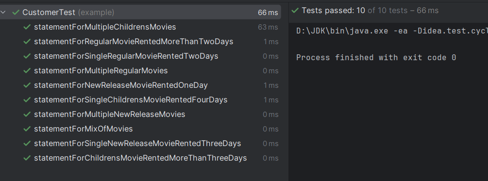

# Overview of the Rental Statement Program

This Rental Statement Program is a Java application designed to manage and calculate rental statements for a movie rental store. It encapsulates the core functionalities required to track movie rentals and calculate the total amount owed and frequent renter points based on various rental scenarios.

## Key Features
- **Movie Management**: The program handles different categories of movies, including regular, new releases, and children's movies.
- **Rental Tracking**: It tracks the number of days a movie is rented and calculates the cost accordingly.
- **Statement Generation**: The program generates detailed rental statements for customers, which include the list of movies rented, the cost for each rental, the total amount owed, and the frequent renter points earned.
- **Extensibility**: The code is structured in a way that allows for easy addition of new features or changes to the pricing and points algorithms.

## Design
The application is designed with the following classes:
- `Movie`: Represents a movie with a title and a category.
- `Rental`: Represents a rental of a movie for a specified number of days.
- `Customer`: Manages a list of rentals and generates a statement of charges and points.
- `Main`: The entry point of the program, setting up sample movies and rentals, and printing out a statement.

## Key remarks
- **Project Naming**: Renamed `movie-rental-ledgern` name of project to `movie-rental-ledger-refactoring-first-phase` – project names should use lowercase letters and hyphens, be unique and original.
- **Enhanced Readability**: Indentation and spacing have been adjusted to improve readability, making the code easier to understand and maintain.

### First Phase of Refactoring
The first phase of refactoring focused on improving the maintainability and readability of the code by addressing the “long method” code smell and “method envy” within the `Customer` and `Rental` classes. The following changes were made:
- **Extract Methods**: For example, the lengthy `statement` method in the `Customer` class was refactored to extract the charge calculation logic into a separate `getCharge` method (renamed from the method `getThisAmount` to better reflect its purpose) within the `Rental` class. This helped to simplify the statement method and adhere to the Single Responsibility Principle.
- **Variables Renaming**: For example, the variable `each` was renamed to `rental` to improve clarity.
- **Inline Variables**: Simplified the code by inlining temporary variables where appropriate. For example, the temporary variable `thisAmount` was renamed to `charge` for better clarity and inlined to reduce unnecessary complexity and improve the performance of the application.
- **Method Envy Resolution**: The `getCharge` and `getFrequentRenterPointsIncrement` (also renamed fo better clarity) methods were moved from the `Customer` class to the `Rental` class, as they were more concerned with the properties of a `Rental` than those of a `Customer`.
- **Static Modifier Removal**: Removed unnecessary static modifiers to allow methods to access instance variables directly. For example, the static modifier was removed from the `getCharge` method to allow it to access instance variables directly, which is more appropriate for the encapsulated logic.
- **Local Variables**: Local variables within loops were refactored to streamline the code and reduce the potential for bugs.
- **Extract and Inline Methods**: Methods for calculating the total charge and total frequent renter points were extracted and then inlined using Java Streams, which resulted in more concise and declarative code.
- **Loop Segregation**: The loops for calculating the total charge and frequent renter points were segregated to separate concerns and simplify the logic.
- **Refactor to Stream Sum**: The loops were replaced with stream operations to sum the charges and frequent renter points, making the code more modern and easier to understand.
- **Test Validation**: During and after refactoring, all existing tests were run to ensure that the changes did not break any functionality. The tests passed successfully, confirming that the refactoring maintained the correctness of the application. The results of tests is presented on image below (all tests were successful):

These refactoring steps have significantly improved the codebase, making it easier to understand, extend and maintain. The use of descriptive method names and the streamlining of calculations align with best practices in Java development.