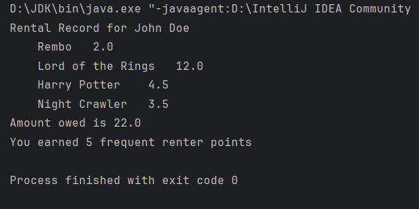
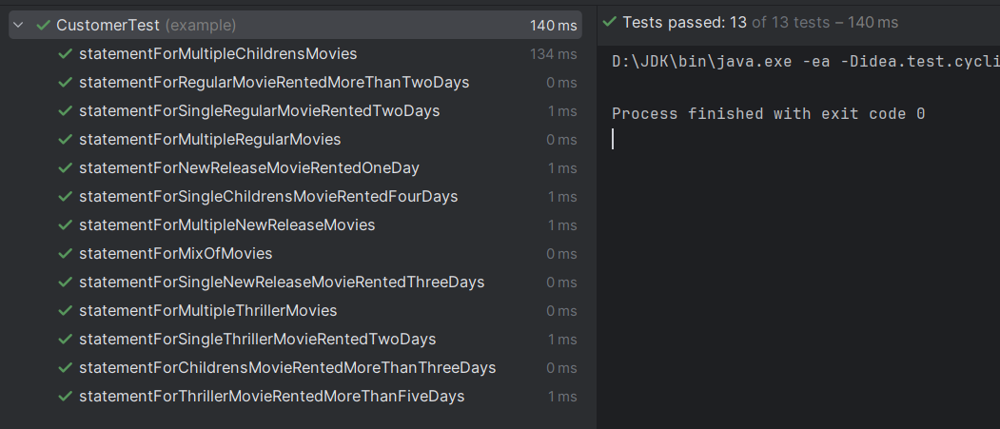

# Overview of the Rental Statement Program

This Rental Statement Program is a Java application designed to manage and calculate rental statements for a movie rental store. It encapsulates the core functionalities required to track movie rentals and calculate the total amount owed and frequent renter points based on various rental scenarios.

## Key Features
- **Movie Management**: The program handles different categories of movies, including regular, new releases, and children's movies.
- **Rental Tracking**: It tracks the number of days a movie is rented and calculates the cost accordingly.
- **Statement Generation**: The program generates detailed rental statements for customers, which include the list of movies rented, the cost for each rental, the total amount owed, and the frequent renter points earned.
- **Extensibility**: The code is structured in a way that allows for easy addition of new features or changes to the pricing and points algorithms.

## Design
The application is designed with the following classes:
- `Movie`: Represents a movie with a title and a category.
- `Rental`: Represents a rental of a movie for a specified number of days.
- `Customer`: Manages a list of rentals and generates a statement of charges and points.
- `Main`: The entry point of the program, setting up sample movies and rentals, and printing out a statement.

## Key remarks
- **Project Naming**: Renamed `movie-rental-ledger-refactoring-first-phase` name of project to `movie-rental-ledger-refactoring-second-phase` – project names should use lowercase letters and hyphens, be unique and original.
- **Enhanced Readability**: Indentation and spacing have been adjusted to improve readability, making the code easier to understand and maintain.

### Second Phase of Refactoring
The second phase of refactoring continued to enhance the design and maintainability of the codebase, focusing on the `Movie` and `Rental` classes and the introduction of a new pricing strategy pattern. It was built upon the initial improvements, introducing a more sophisticated design pattern and further enhancing the code’s modularity and flexibility. The following changes were made:
- **Enum Extension**: The `MovieType` enum was extended to include `THRILLER`, accommodating the new movie category within the application’s logic.
- **Rental Class Enhancements**: 
  - The `getCharge` method in the `Rental` class was updated to handle the `THRILLER` case, reflecting the unique pricing rules for this new category.
  - The `getFrequentRenterPointsIncrement` method was also updated to award additional frequent renter points for `THRILLER` movies rented beyond a certain duration.
- **Test Suite Expansion**:
  - Three new tests were added to cover the `THRILLER` category, ensuring the correct calculation of charges and frequent renter points.
  - An existing test was updated to reflect the changes in the `Rental` class’s logic.
- **Dynamic Movie Types:** The refactoring accounted for the possibility of movies changing types, such as from `NEW_RELEASE` to another category, by decoupling the price calculation from static types.
- **Price Strategy Pattern**:
  - A major shift was made by moving all pricing logic from the `Rental` class to the `Movie` class and eventually to a new set of classes representing pricing strategies.
  - The `Price` class was introduced as an abstract class with two abstract methods, `getPrice` and `getFrequentRenterPointsIncrement`, to be implemented by concrete subclasses for each movie genre.
- **Concrete Price Classes**: Concrete classes `RegularPrice`, `NewReleasePrice`, `ChildrensPrice` and `ThrillerPrice` were created, each extending the `Price` class and overriding its abstract methods to provide genre-specific pricing logic.
- **Refactoring Movie Class**:
  - The `Movie` class was refactored to include a `Price` field, replacing the previous `priceCode` field.
  - Methods `getPriceCode`, `charge` and `getFrequentRenterPoints` were removed from the `Movie` class as their responsibilities were transferred to the `Price` strategy classes.
  - The `MovieType` enum was removed as the type-specific behavior is now handled by the `Price` subclasses.
- **Changes in Rental Class**: Updated the `Rental` class to delegate the charge calculation and frequent renter points logic to the associated `Price` object of the `Movie`. This was achieved by changing the `getCharge` method to `return movie.getPrice().getPrice(daysRented);` and the `getFrequentRenterPointsIncrement` method to `return movie.getPrice().getFrequentRenterPointsIncrement(daysRented);`.
- **Main Class Update**:
  - The `Main` class was updated to instantiate `Movie` objects with the new `Price` subclasses, reflecting the removal of the `MovieType` enum.
  - The instantiation of the `NIGHT_CRAWLER` movie as a `THRILLER` was added to demonstrate the new structure:

- **Test and Main Class Synchronization**:
  The tests and the `Main` class were synchronized to use the new `Price` subclasses instead of the removed `MovieType` enum, ensuring consistency across the application.
- **Test Validation**:
  During and after refactoring, all existing tests were run to ensure that the changes did not break any functionality. The tests passed successfully, confirming that the refactoring maintained the correctness of the application:
  

These changes have significantly improved the codebase, making it more modular, easier to understand, and easier to maintain. The introduction of the pricing strategy pattern is a major step towards a more object-oriented design and provides a solid foundation for future enhancements, without the need to alter the existing code structure.