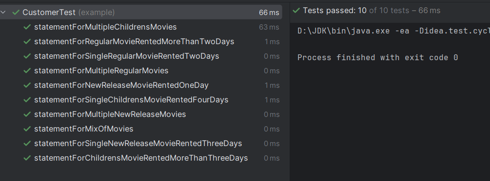

# Overview of the Rental Statement Program

This Rental Statement Program is a Java application designed to manage and calculate rental statements for a movie rental store. It encapsulates the core functionalities required to track movie rentals and calculate the total amount owed and frequent renter points based on various rental scenarios.

## Key Features
- **Movie Management**: The program handles different categories of movies, including regular, new releases, and children's movies.
- **Rental Tracking**: It tracks the number of days a movie is rented and calculates the cost accordingly.
- **Statement Generation**: The program generates detailed rental statements for customers, which include the list of movies rented, the cost for each rental, the total amount owed, and the frequent renter points earned.
- **Extensibility**: The code is structured in a way that allows for easy addition of new features or changes to the pricing and points algorithms.

## Design
The application is designed with the following classes:
- `Movie`: Represents a movie with a title and a category.
- `Rental`: Represents a rental of a movie for a specified number of days.
- `Customer`: Manages a list of rentals and generates a statement of charges and points.
- `Main`: The entry point of the program, setting up sample movies and rentals, and printing out a statement.

## Key remarks
- **Project Naming**: Renamed `refactoring1stEdition` name of project to `movie-rental-ledger` – project names should use lowercase letters and hyphens, be unique and original.
- **Code Comments in Class `CustomerTest`**: Added appropriate comments for clarity and emphasizing of the expected results for each test.
- **Indentation in Class `CustomerTest`**: Adjusted indentation and blank lines throughout code with tests for consistency and adherence to style guide guidelines (Google Java Style Guide).
- **Readability in Class `CustomerTest`**: Formatted code with tests consistently.

## Testing

### Overview
The `CustomerTest` class contains a suite of unit tests that verify the functionality of the `Customer` class, particularly the `statement` method. These tests ensure that the method correctly calculates and formats the statement given different types of movie rentals.

### Test Cases
The tests cover a variety of scenarios including:
- Single movie rentals for each category (Regular, New Release, Children's).
- Rentals spanning multiple days, testing the price calculation logic.
- Multiple rentals of the same type to ensure cumulative calculations are correct.
- A mix of different movie types to test the overall statement generation.

### Running Tests
To run the tests, we should ensure that we have JUnit set up in project. If we're using Maven, the dependencies should be defined in `pom.xml`.

### Results of Tests
The results of tests is presented on image below (all tests were successful):

