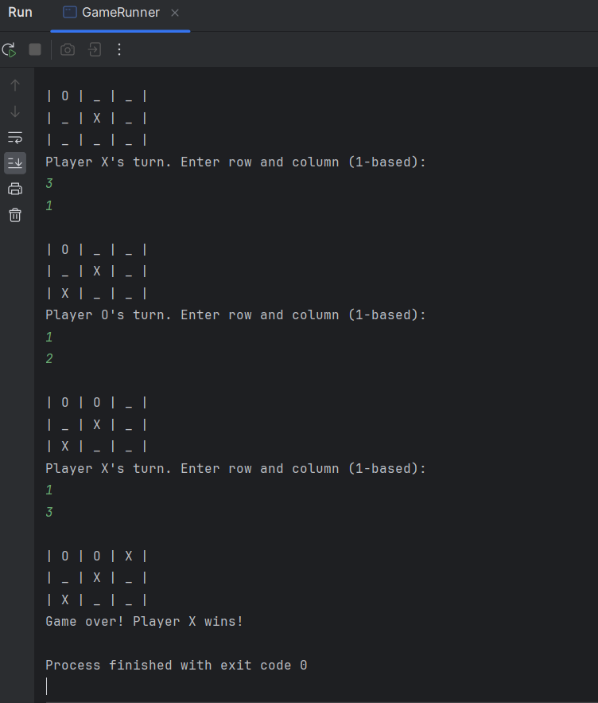
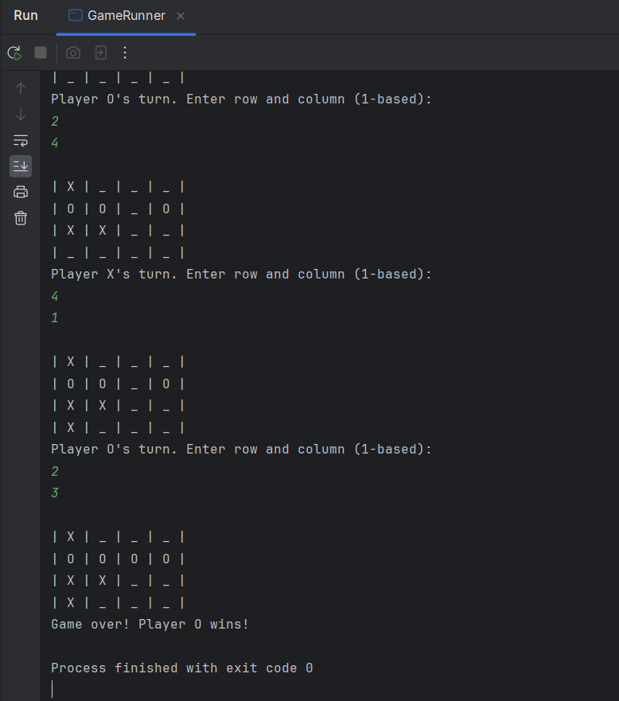
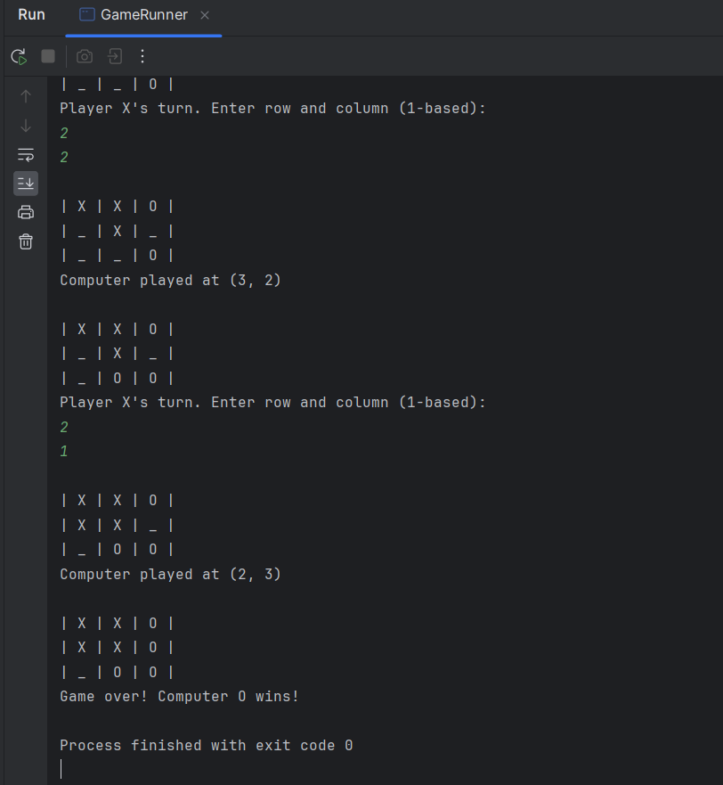
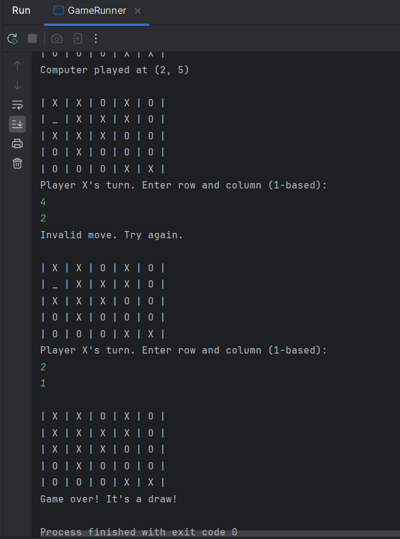

# Overview of the Tic Tac Toe Game Refactoring
This Tic Tac Toe Game Refactoring project is a Java application that has been improved and optimized from its original version. The refactoring process involved enhancing the code structure, readability and maintainability while preserving the game’s functionality.

## Key Features
- **Game Logic Enhancement**: The game logic has been refactored to be more concise and efficient.
- **User Interface Improvement**: The text-based user interface has been made more user-friendly and informative.
- **Code Quality**: The code has been revised to follow best practices and coding standards, such as the Google Java Style Guide.
- **Extensibility**: The new structure allows for easier future enhancements, such as adding AI opponents or graphical interfaces.

## Design
The refactored application consists of the following classes:
- `PlayGround`: Manages the game board and checks for game-over conditions.
- `Symbol (Enum)`: Represents the two possible symbols on the Tic Tac Toe board: ‘X’ and ‘O’. It enhances code readability and allows for easy expansion if additional symbols are introduced in the future.
- `Logic (Interface)`: Defines the common contract for game logic, including the `play()` method that manages the game flow. By adhering to this interface, we ensure consistency and extensibility when adding new game modes or variations.
- `LogicPlayerVsPlayerImpl`: Implements the game logic for two players playing against each other.
- `LogicPlayerVsComputerImpl`: Implements the game logic for a player playing against the computer.
- `GameRunner`: The entry point of the program, which sets up the game and starts the chosen mode.

## Key Remarks and Detailed Improvements

### Code Quality Enhancements
- **Project Naming**: Renamed from `crosses-master` to `tic-tac-toe-game-refactoring` to better reflect the project’s purpose and to adhere to naming conventions.
- **Metadata Annotations**: Metadata annotations have been added throughout the codebase. This metadata provides valuable context such as the authorship, purpose, versioning and date of creation, which is essential for maintaining a professional and well-documented codebase.
- **Code Comments**: Enhanced comments throughout the codebase for better clarity and maintainability.
- **Inclusion of `@param` and `@return` Tags**: Throughout the refactoring process, special attention was given to the documentation of methods. `@param` tags were added to clearly describe the purpose and type of each parameter a method accepts. `@return` tags were used to explain what the method returns, enhancing the understandability of the codebase.
- **Consistent Formatting**: Applied consistent formatting across all classes to improve readability.
- **Enhanced Readability**: Indentation and spacing have been also adjusted to improve readability, making the code easier to understand and maintain.
- **Logic Separation**: Separated the game logic into distinct classes for player-vs-player and player-vs-computer scenarios, facilitating easier updates and maintenance.
- **Customizable Board Size**: The refactored game allows for different board sizes beyond the standard 3x3 grid. By adjusting the board size, players can enjoy variations of Tic Tac Toe with larger or smaller grids.
- **Improvement of `LogicPlayerVsComputerImpl` class**: The `LogicPlayerVsComputerImpl` class can be further enhanced by replacing the current random move generation with the Minimax algorithm, which is a decision-making technique used in two-player games (such as Tic Tac Toe) to find the optimal move. It explores all possible moves by simulating the game recursively and assigning scores to each move. The goal is to maximize the computer’s chances of winning while minimizing the opponent’s chances. This would not only make the computer opponent more strategic but also provide a template for implementing various AI difficulty settings.

### Class Responsibilities
- **`PlayGround` Class**: Central to the game’s functionality, this class manages the Tic Tac Toe board state. It provides methods to initialize the board, set symbols, check for wins or draws and print the board state to the console. The refactoring focused on enhancing method names for clarity and adding comprehensive comments for maintainability.
- **`Symbol` Enum**: Defines the symbols used in the game (X, O and BLANK). The refactoring introduced this enum to replace magic characters, thereby improving code readability and making future changes easier.
- **`Logic` Interface**: Establishes a contract for implementing game logic, ensuring consistency across different game modes. The refactoring introduced this interface to decouple game logic from user interaction, allowing for flexible expansions or modifications.
- **`LogicPlayerVsPlayerImpl` Class**: This class encapsulates the logic required for a two-player game mode. It handles turn-taking, move validation and determines the game outcome. Refactoring efforts included improving the readability of the turn-taking process and providing clear prompts and feedback to the players.
- **`LogicPlayerVsComputerImpl` Class**: Designed for games against a computer opponent, this class includes logic for random move generation and could be further improved with a Minimax algorithm for more challenging gameplay. The refactoring process made the game flow more understandable.
- **`GameRunner` Class**: Serves as the entry point for the application, offering users the choice between different game modes and board sizes. The class was refactored to ensure a user-friendly experience with clear instructions and input validation.

## Result Samples

The result samples are presented on images below:
- **Player vs. Player (3x3 Board) - Player X Wins:**
    * **Game Mode:** Player vs. Player
    * **Board Size:** 3x3
    * **Winner:** Player X

- **Player vs. Player (4x4 Board) - Player O Wins:**
    * **Game Mode:** Player vs. Player
    * **Board Size:** 4x4
    * **Winner:** Player O

- **Player vs. Computer (3x3 Board) - Computer O Wins:**
    * **Game Mode:** Player vs. Computer
    * **Board Size:** 3x3
    * **Winner:** Computer O

- **Player vs. Computer (5x5 Board) - Draw (including case with wrong move):**
    * **Game Mode:** Player vs. Computer
    * **Board Size:** 5x5
    * **Winner:** Draw (No winner)

These detailed improvements have significantly increased the quality and maintainability of the Tic Tac Toe game codebase, setting a strong foundation for future development and enhancements.